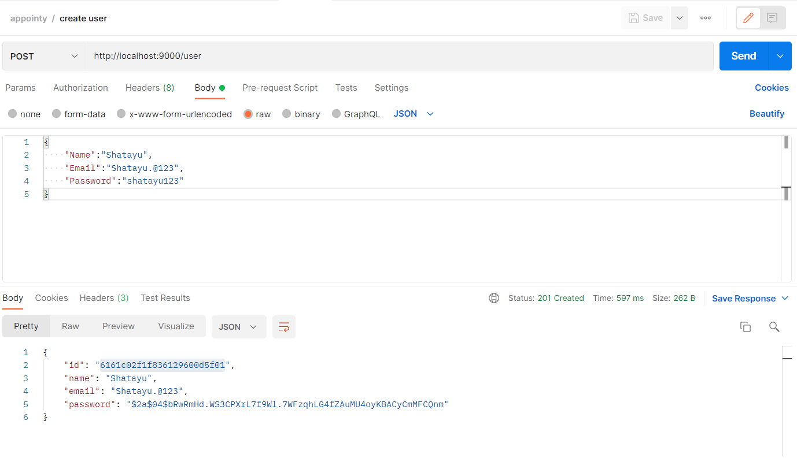
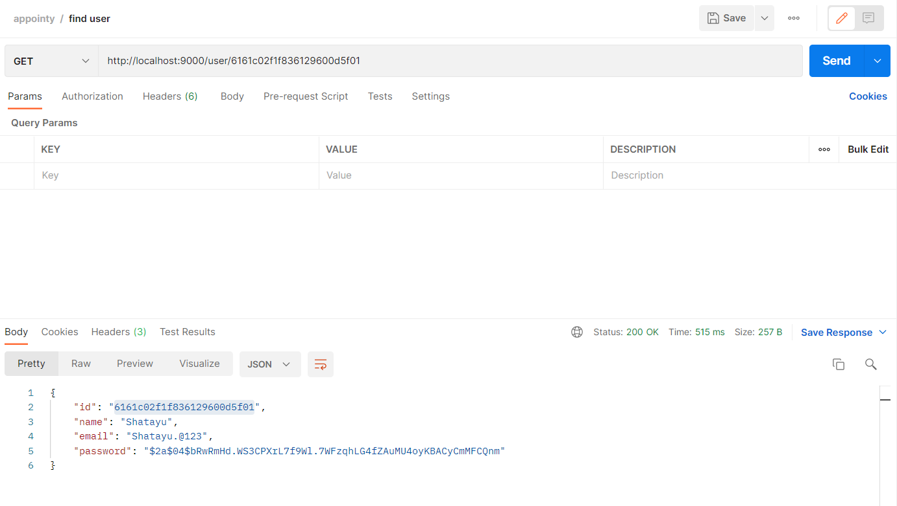
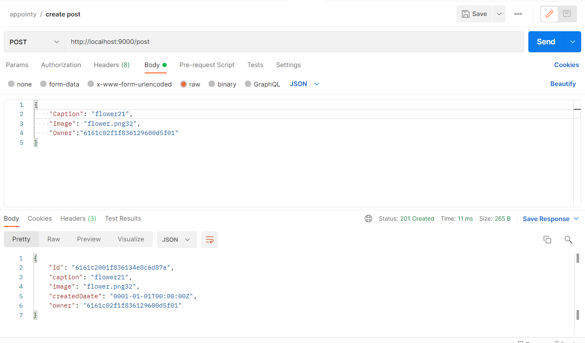
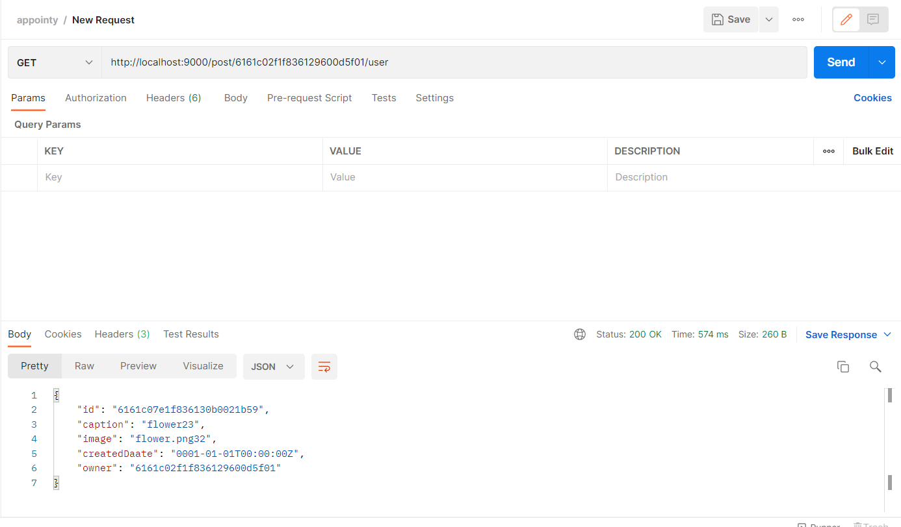

# Appointy

### Task | Instagram Backend API

## Submission By: 

### Shatayu Mittal

>Email ID - shatayu.mittal2019@vitstudent.ac.in 

>[LinkedIn](https://www.linkedin.com/in/shatayu-mittal-521b64200/)

# HTTP JSON APIs

## Create an User 
### Route:  `{BASE_URL}/user`
### HTTP Method: `POST`
### Expected Parameters:
```go
{
  "name": {type: string},
  "email": {type: string},
  "password": {type: string}
}
```

### Response:

```go 
{
	“status”: 201 // http status code,
}
```

### This endpoint handles the following:
1. Encrypting the user’s password with the standard bcrypt module.
2. Creating the user document and saving it in the User collection.

<div align="center">

</div>
<hr />

## Get a user using id
### Route: `{BASE_URL}/user/:id`
### HTTP Method: `GET`
### Expected Parameters:
```go
{
  “params”: {“Id”: {type:String}
}
```
### Response: 
```go
{
  “id”: {type: string},
  "name": {type: string},
  "email": {type: string}
}
```
### This endpoint handles the following:
1. Querying the User collection with the id and finding the associated user.
2. Filtering the fetched details and sending them as a response.

<div align="center">

</div>

<hr />

## Create a Post
### Route: `{BASE_URL}/post`
### HTTP Method: `POST`
### Expected Parameters:
```go 
{
  “caption”: {type: string},
  "imageURL": {type: string},
  "owner": {type: string}
}
```

### Response: 
```go 
{
  “id”: {type: string},
  “caption”: {type: string},
  "imageURL": {type: string},
  "owner": {type: string},
  ”createdat”: {type:date}
}
```

### This endpoint handles the following:
1. Saving the post document in the Post collection, linking the post with the associated user.
2. Returning back the created post as a response.

<div align="center">

</div>
<hr />

## Get a post using id
### Route: `{BASE_URL}/post/:id`
### HTTP Method: `GET`
### Expected Parameters:
```go 
{
  “params”:{“Id”: {type:String}
}
```

### Response: 
```go 
{
  “id”:{type: string},
  “caption”:{type: string},
  "imageURL":{type: string},
  "owner":{type: string},
  ”createdat”:{type:date}
}
```

### This endpoint handles the following:
1. Querying the Post collection with the id and finding the associated post.
2. Filtering the fetched details and sending them as a response.


<div align="center">

</div>
<hr />

## List all posts of a user
### Route: `{BASE_URL}/post/user/:id`
### HTTP Method: `GET`
### Expected Parameters:
```go 
{
  “params”:{“Id”: {type:String}
}
```

### Response: 
```go 
[{
  “id”:{type: string},
  “caption”:{type: string},
  "imageURL":{type: string},
  "owner":{type: string},
  ”createdat”:{type:date}
},
{...},{...}]
```

### This endpoint handles the following:
1. Querying the Post collection with the user_id and finding the associated posts.
2. Filtering the fetched details and sending them a response.


<div align="center">

</div>
<hr />
